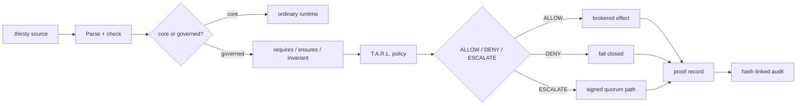
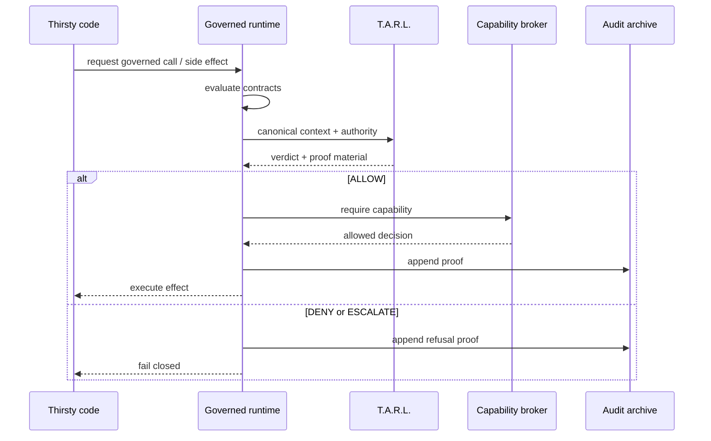
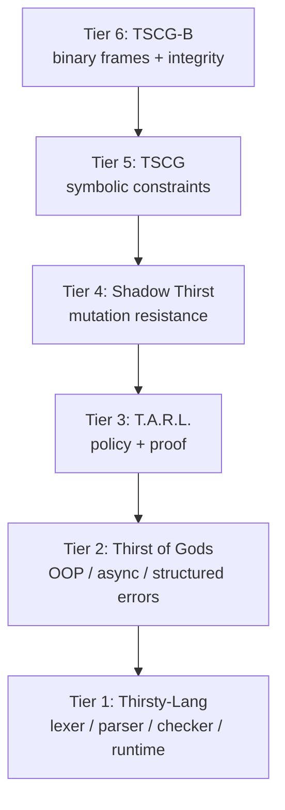

# Thirsty-Lang

[](https://pypi.org/project/thirsty-lang/)
[](https://pypi.org/project/thirsty-lang/)
[](LICENSE)
[](https://github.com/TP-IAmSoThirsty/TP-Thirsty-Lang-Official/actions/workflows/smoke.yml)
[](https://github.com/TP-IAmSoThirsty/TP-Thirsty-Lang-Official/actions/workflows/release.yml)
[](https://github.com/TP-IAmSoThirsty/TP-Thirsty-Lang-Official/actions/workflows/docker.yml)

```text
       ~ ~ ~        THIRSTY-LANG        ~ ~ ~
   source -> verdict -> proof -> audit -> governed effect
       no policy        no authority        no silent downgrade
                 DENY is the default current
```

**A governance-first programming language family for code that has to justify
itself before it acts.**

The programming language wars are not over. Governance is just getting started.

Thirsty-Lang is not trying to be a prettier Python syntax. It is a defensive
runtime and language stack where execution, side effects, policy, proof,
authority, audit, mutation, symbolic constraints, and build outputs are treated
as governable surfaces.

The core posture is simple:

- 🌊 no policy means deny
- 🔐 no authority means deny
- 🧾 no proof means no governed-execution claim
- ⚡ no side effect before a verdict
- 🧱 no silent downgrade when a governed path cannot be preserved

## Current Map



## Install

```bash
pip install thirsty-lang
```

Pinned release:

```bash
pip install thirsty-lang==0.8.2
```

From source:

```bash
git clone https://github.com/TP-IAmSoThirsty/TP-Thirsty-Lang-Official.git
cd TP-Thirsty-Lang-Official
pip install -e .
```
---
## Why Thirsty-Lang? ##

*Traditional programming languages answer one question well:*

Can this code execute?

*Thirsty-Lang asks an additional question:*

Should this code execute under the current authority, policy, and context?

*Instead of treating governance as documentation, middleware, or operational policy applied after deployment, Thirsty-Lang treats governance as part of the execution model itself. Sensitive operations can require policy evaluation, authority verification, proof generation, and audit recording before producing governed effects.*

The result is a language designed to make execution not only programmable, but explainable, attributable, and defensible.

---
## A First Thirsty Program ##

```thirsty
module hello: core

glass greet(name) {
    return "hello, " + name + "!"
}

drink message = greet("governed world")
pour message
```

Run it:

```bash
thirsty run hello.thirsty
```

The welcoming syntax is only the surface. The language becomes more interesting
when the program asks to touch something real.

## Governed Execution

Governed code declares contracts and then passes through policy before sensitive
effects happen.

```thirsty
module bank: governed

glass withdraw(amt) requires amt > 0 ensures result >= 0 {
    return amt * 2
}
```

Runtime enforcement includes:

- 🧪 `requires`, `ensures`, and `invariant` checks
- 🚧 static and runtime blocking of governed calls from ordinary `core` mode
- 🧭 T.A.R.L. policy routing for governed calls and capability gates
- 🧾 proof-bearing `ALLOW`, `DENY`, and `ESCALATE` decisions
- 🛑 non-swallowable `GovernanceViolation` denials
- 🧯 fail-closed parsing for governed modules
- 📦 build refusal when a target would drop governance unless the loss is explicitly disclosed

## T.A.R.L.: Policy As Resistance

T.A.R.L. is Thirsty's Active Resistance Language. It is a policy engine built
around explicit verdicts, not optimistic defaults.

```tarl
policy access_control

when user.role == "admin" => ALLOW
when action == "delete" and resource == "critical" => ESCALATE
when user.ip in blacklist => DENY
when true => DENY
```

Implemented policy surfaces include:

- 🌊 first-match-wins rule evaluation
- 🚦 `ALLOW`, `DENY`, and `ESCALATE` verdicts
- 🧪 sandboxed expression evaluation
- ⏱️ temporal policy windows
- 🔏 HMAC and Ed25519 proof certificates
- 🧷 strict proof verification flags for hardened use
- 🔁 replay, freshness, revocation, context, and policy-hash checks
- ⛓️ hash-linked audit archives with chain verification

## Resistance Flow



## Defensive Capabilities

Thirsty-Lang's defensive model is designed for hostile or ambiguous execution
contexts: agents, plugins, generated code, local scripts, imports, and tool
adapters.

| Current | Capability | Defensive effect |
|---|---|---|
| 🌊 | Default-deny governed mode | Missing policy, authority, proof, or audit state refuses execution instead of granting it |
| 🚪 | Capability broker | External effects such as FFI/native calls and tool invocations can be mediated before execution |
| 🧰 | Sensitive stdlib gates | File, network, process, env, database, logging, and related calls are treated as capability-bearing effects |
| 🔐 | Signed authority claims | Hardened mode can require authenticated authority instead of trusting a raw string like `admin` |
| 🧾 | Proof verifier | Rejects tampered, stale, unsigned, wrong-key, revoked, or context-mismatched decisions when strict checks are enabled |
| ⛓️ | Hash-linked audit | Proof archives can detect edits, deletions, and reordering |
| ⏱️ | Trusted clock | Temporal policy can use signed time instead of the host clock |
| 🗺️ | Path guard | Filesystem roots can be canonicalized and confined against traversal and symlink escape |
| 🗳️ | Policy lint and quorum | Broad `ALLOW` rules can be flagged, and `ESCALATE` can require distinct signed approvals |
| 🧯 | Parser fail-closed path | Governed parse errors discard recovered executable statements instead of running partial code |

The offensive challenge catalog is maintained in
[`docs/THREAT_MODEL.md`](docs/THREAT_MODEL.md). The feature matrix is maintained
in [`docs/STATUS.md`](docs/STATUS.md).

## The Six-Tier Stack



| Tier | Current | Name | What it contributes |
|---:|---|---|---|
| 1 | 💧 | Thirsty-Lang | Lexer, parser, checker, interpreter, formatter, CLI, module system, JS build target, contracts, and core syntax |
| 2 | ⚡ | Thirst of Gods | Object-oriented, async, and structured-error validation over the real AST |
| 3 | 🛡️ | T.A.R.L. | Policy-as-code, proof-carrying verdicts, temporal rules, composition, and audit hooks |
| 4 | 🌑 | Shadow Thirst | Mutation analysis, determinism checks, plane isolation, purity checks, resource estimation, and promotion blocking |
| 5 | 🧬 | TSCG | Symbolic constraint grammar with canonicalized constraint expressions |
| 6 | 📡 | TSCG-B | Binary frame protocol with CRC32 and SHA-256 integrity checks |

## Unique Language Features

Thirsty-Lang uses its own vocabulary, but the names map to concrete execution
behavior:

| Syntax | Current | Meaning |
|---|---|---|
| `drink` | 💧 | declares bindings |
| `pour` | 🌊 | outputs through the runtime |
| `glass` | 🥛 | declares functions |
| `fountain` | ⛲ | declares classes |
| `refill` | 🔁 | loops |
| `times` | ⏲️ | repeats a block |
| `spillage` / `cleanup` / `throw` | 🧯 | models structured error handling |
| `cascade` | ⚡ | models async flow |
| `requires` / `ensures` / `invariant` | 🧪 | turns governance into executable checks |
| `module name: governed` | 🛡️ | moves code into the governed execution path |

Example:

```thirsty
module counters: core

fountain Counter {
    drink count: Int = 0

    glass increment() {
        this.count = this.count + 1
        return this.count
    }
}

drink c = new Counter()
times 3 { pour c.increment() }
```

## CLI Surface

Primary commands:

```bash
thirsty --help
thirsty run program.thirsty
thirsty fmt program.thirsty
thirsty build program.thirsty --target js
thirsty build program.thirsty --target js --policy policy.tarl --emit-manifest
thirsty prove program.thirsty --policy policy.tarl --emit-manifest
thirsty explain-denial program.thirsty --policy policy.tarl
thirsty govern program.thirsty
thirsty lsp

tarl --help
tarl eval policy.tarl --context '{"role":"admin"}'
tarl eval temporal-policy.tarl --context '{"role":"admin"}' --now 2026-07-01T12:00:00Z
tarl verify proof.json --ed25519-only
tarl audit verify-chain audit.db

shadow-thirst --help
tscg --help
tscg-b --help
thirst-of-gods --help
```

| Command | Current | Surface |
|---|---|---|
| `thirsty` | 🌊 | run, format, build, static proof-obligation reports, denial explanations, govern, LSP, docs |
| `tarl` | 🛡️ | evaluate policies, verify proofs, inspect audits |
| `shadow-thirst` | 🌑 | analyze mutation and promotion risk |
| `tscg` | 🧬 | parse and canonicalize symbolic constraints |
| `tscg-b` | 📡 | encode and decode binary constraint frames |
| `thirst-of-gods` | ⚡ | validate higher-tier language contracts |

Proof-oriented commands are static unless explicitly documented otherwise:

- `thirsty prove program.thirsty --policy policy.tarl --emit-manifest` parses,
  checks, and emits a machine-readable proof-obligation report without executing
  program side effects. The report includes functions, imports, sensitive
  stdlib calls, governed calls, required TARL actions, required capabilities,
  context schema, authority requirements, contract obligations, proof mode,
  audit requirement, governance-loss status, and unresolved proof gaps.
  Required TARL actions include capability actions and governed function-call
  actions.
- `thirsty explain-denial program.thirsty --policy policy.tarl` emits a
  machine-readable explanation of missing policy, context, authority, and proof
  conditions for the static obligation set.
- `thirsty build ... --emit-manifest --policy policy.tarl` records source and
  policy hashes, required capabilities, context schema, proof/audit
  requirements, Shadow status when statically visible, and governance-loss
  status in the build manifest.

Explicit context schemas can be attached with `--context-schema schema.json`.
The compact schema shape is:

```json
{"fields": {"user.role": "string", "risk": {"kind": "number", "required": false}}}
```

T.A.R.L. verification is secure by default: `tarl verify` and
`ProofVerifier()` reject unsigned proofs unless `--allow-unsigned` or
`ProofVerifier(require_signature=False)` is used explicitly for local
inspection. `tarl eval` refuses temporal policy windows and `CURRENT_*`
builtins unless `--now` supplies the trusted evaluation time.

## Evidence-First Claims

This project keeps defensive claims tied to files that can be inspected:

- status matrix: [`docs/STATUS.md`](docs/STATUS.md)
- adversary model and challenge catalog: [`docs/THREAT_MODEL.md`](docs/THREAT_MODEL.md)
- governance runtime model: [`docs/governance_model.md`](docs/governance_model.md)
- grammar: [`docs/GRAMMAR.md`](docs/GRAMMAR.md)
- language specification: [`docs/LANGUAGE_SPEC.md`](docs/LANGUAGE_SPEC.md)
- production acceptance tests: [`tests/test_production_acceptance.py`](tests/test_production_acceptance.py)
- offensive threat suites: [`tests/test_threat_model_broker.py`](tests/test_threat_model_broker.py), [`tests/test_threat_model_authority.py`](tests/test_threat_model_authority.py), [`tests/test_threat_model_audit_chain.py`](tests/test_threat_model_audit_chain.py), [`tests/test_threat_model_failclosed.py`](tests/test_threat_model_failclosed.py)

Run the main validation suite:

```bash
python -m pytest tests/ -q
```

Optional static and package checks:

```bash
ruff check src tests
mypy -p utf
python -m build
```

## Why This Exists

Most languages ask: can this code run?

Thirsty-Lang asks harder questions:

- Who is acting?
- What authority was proven?
- Which policy allowed it?
- What exact context was evaluated?
- What proof was produced?
- Can the audit chain detect tampering?
- Can a build target preserve governance, or does it have to confess the loss?
- Can an agent or tool adapter reach a side effect without crossing the broker?

That is the war surface now. Syntax still matters. Performance still matters.
Ergonomics still matter. But governance is becoming part of the language
runtime, not a document stapled to the side.

```text
        source
          |
       parser
          |
   contracts + policy
          |
    ALLOW / DENY / ESCALATE
          |
       proof
          |
       audit
          |
   only then: effect
```

## License

Apache-2.0. Copyright 2026 Thirsty's Projects LLC.

Security reports: `FounderOfTP@thirstysprojects.com`
